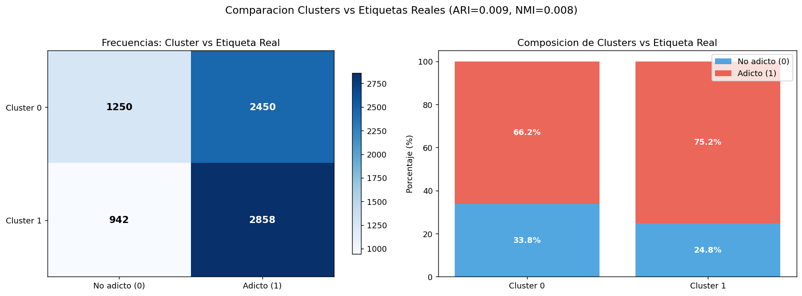
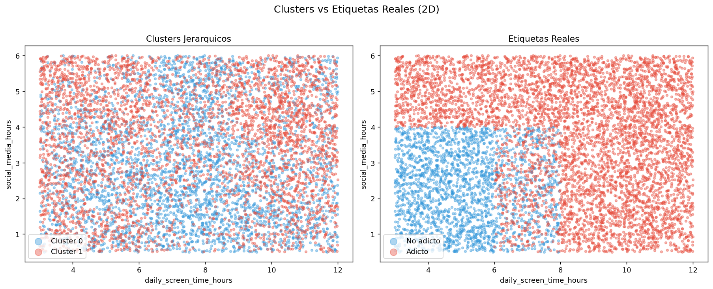

# Gráficas

A continuación se presenta una recopilación de todas las visualizaciones generadas a lo largo del ciclo de vida del dato.

---

## Fase I: Preprocesamiento y Análisis Exploratorio de Datos (EDA)

### 1. Mapa de Valores Faltantes

### 2. Distribuciones Numéricas

### 3. Distribuciones Categóricas

### 4. Correlaciones Lineales y Monótonas

### 5. Relación Numérica vs Variable Objetivo

### 6. Detección de Valores Atípicos (Outliers)

### 7. Variables Categóricas vs Variable Objetivo

### 8. Distribución de Variables por Grupo de Adicción

### 9. Pairplot de Variables Clave

### 10. Distribución de Valores Faltantes vs No Faltantes

### 11. Nivel de Adicción (Variable Original) vs Variable Objetivo

### 12. Importancia Relativa por Paso (Stepwise Forward)

### 13. Evolución del Criterio AIC

### 14. Correlaciones del Dataset Final

---

## Fase II: Modelización Supervisada

### 15. Curvas ROC Combinadas

### 16. Matrices de Confusión

### 17. Comparativa de Métricas de Test

### 18. Importancia de Variables (Random Forest Gini)

### 19. Curvas de Aprendizaje (Learning Curves)

### 20. Compromiso Sesgo-Varianza por Modelo

### 21. Distribución de Probabilidades Predichas

---

## Fase III: Aprendizaje No Supervisado (Clustering)

### 22. Dendrogramas (Comparativa de Enlaces)

### 23. Puntuación Silhouette por Valor de k

### 24. Perfiles Radiales/Líneas de los Clusters

### 25. Distribuciones por Cluster (Boxplots)

### 25b. Clusters vs Etiquetas Reales de Adicción

### 26. Proyecciones 2D de Clusters

### 26b. Proyecciones 2D (Clusters vs Etiquetas Reales)

### 27. Diagrama de Silueta Individual (k=6)

---

## Fase IV: Interpretación y Conclusiones

### 28. Diagnóstico de Residuos (Regresión Logística)

### 29. Test de Bondad de Ajuste (Hosmer-Lemeshow)

### 30. Importancia por Permutación (Permutation Importance)

### 31. Comparativa de Importancia (Gini vs Permutación)

### 32. Razones de Probabilidad (Odds Ratios)

