**Autor:** Álvaro Inclán  
**Asignatura:** Minería de Datos - Grado en Matemáticas  
**Dataset:** Smartphone Addiction Prediction Data  

---
## 1. Preprocesamiento - Análisis Exploratorio de Datos (EDA)

## 1.1. Descripción y Contexto

**Descripción del dataset**

**Contexto y motivación**

La adicción al smartphone es un fenómeno de creciente interés en la investigación y la salud pública. La OMS ha reconocido el uso problemático de dispositivos digitales como factor de riesgo asociado a trastornos del sueño, ansiedad y deterioro del rendimiento académico. En España, el 99,5% de los jóvenes de 16 a 24 años usa el móvil a diario, con un tiempo medio de pantalla superior a 5 horas (INE, 2024).

En este contexto, **predecir y segmentar el riesgo de adicción** a partir de datos comportamentales resulta de gran utilidad para diseñar intervenciones preventivas personalizadas.

**Fuente y estructura general**

El dataset *Smartphone Addiction Prediction Data* contiene **7 500 registros** y **16 variables** que recogen patrones de uso del smartphone. Está orientado a **clasificación binaria**, donde `addicted_label` indica si un usuario es adicto (1) o no (0).

**Justificación de la elección**

- **Relevancia social:** Problema contemporáneo con implicaciones en salud mental y rendimiento académico.
- **Adecuación al trabajo:** Mezcla de variables numéricas y categóricas, target binario y tamaño moderado (7 500 filas), lo que permite aplicar todas las técnicas requeridas.


**Descripción de las variables**

| Variable | Tipo | Descripción |
|----------|------|-------------|
| `transaction_id` | `str` | ID único del registro (excluir) |
| `user_id` | `str` | ID único del usuario (excluir) |
| `daily_screen_time_hours` | `float64` | Tiempo total de pantalla diario (h) [3.0, 12.0] |
| `social_media_hours` | `float64` | Horas diarias en redes sociales [0.5, 6.0] |
| `gaming_hours` | `float64` | Horas diarias en videojuegos [0.0, 4.0] |
| `work_study_hours` | `float64` | Horas diarias de uso productivo [0.5, 6.0] |
| `weekend_screen_time` | `float64` | Tiempo de pantalla en fines de semana (h) [3.58, 14.88] |
| `age` | `int64` | Edad del usuario [18, 35] |
| `sleep_hours` | `float64` | Duración media del sueño (h) [4.5, 9.0] |
| `notifications_per_day` | `int64` | Notificaciones recibidas al día [20, 250] |
| `app_opens_per_day` | `int64` | Aperturas de apps al día [15, 180] |
| `gender` | `str` | Male, Female, Other |
| `stress_level` | `str` | Low, Medium, High |
| `academic_work_impact` | `str` | Yes, No |
| `addiction_level` | `str` | Mild, Moderate, Severe (819 NaN, 10.9%) |
| **`addicted_label`** | **`int64`** | **0 (no adicto), 1 (adicto) - Variable objetivo** |

**Clasificación de las variables**

| Rol | Variables | Cantidad |
|-----|-----------|----------|
| **Identificadores** | `transaction_id`, `user_id` | 2 |
| **Predictoras numéricas** | `age`, `daily_screen_time_hours`, `social_media_hours`, `gaming_hours`, `work_study_hours`, `sleep_hours`, `notifications_per_day`, `app_opens_per_day`, `weekend_screen_time` | 9 |
| **Predictoras categóricas** | `gender`, `stress_level`, `academic_work_impact` | 3 |
| **Candidata a excluir** | `addiction_level` | 1 |
| **Variable objetivo** | `addicted_label` | 1 |

---

## 1.2. Análisis Exploratorio de Datos (EDA)

**Análisis de valores faltantes**

El análisis de completitud revela un dataset notablemente limpio. La única variable con valores ausentes es `addiction_level` con **819 NaN (10.92%)**. El resto de variables tiene 0 faltantes. El total de celdas faltantes es 819 de 120 000 (0.68%).

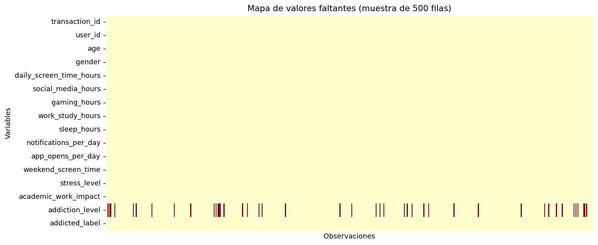

!!! note "Observación sobre `addiction_level`"
    `addiction_level` tiene una relación **determinista** con `addicted_label`: Mild => label=0, Moderate/Severe => label=1. Es una recodificación de la variable objetivo, por lo que debe **excluirse** del modelado para evitar *data leakage*. No se requiere imputación.

---

**Estadísticos descriptivos**

| Variable | Media | Mediana | Desv. Típica | Mín | Máx | Asimetría | Curtosis |
|----------|-------|---------|---------------|-----|-----|-----------|----------|
| `age` | 26.57 | 27.00 | 5.20 | 18 | 35 | -0.021 | -1.226 |
| `daily_screen_time_hours` | 7.50 | 7.53 | 2.61 | 3.00 | 12.00 | -0.011 | -1.216 |
| `social_media_hours` | 3.27 | 3.27 | 1.59 | 0.50 | 6.00 | -0.010 | -1.196 |
| `gaming_hours` | 2.01 | 2.04 | 1.15 | 0.00 | 4.00 | -0.017 | -1.185 |
| `work_study_hours` | 3.24 | 3.23 | 1.60 | 0.50 | 6.00 | +0.006 | -1.216 |
| `sleep_hours` | 6.74 | 6.72 | 1.28 | 4.50 | 9.00 | +0.019 | -1.175 |
| `notifications_per_day` | 134.26 | 134.00 | 66.59 | 20 | 250 | +0.003 | -1.189 |
| `app_opens_per_day` | 97.83 | 98.00 | 48.42 | 15 | 180 | -0.010 | -1.218 |
| `weekend_screen_time` | 9.24 | 9.26 | 2.72 | 3.58 | 14.88 | -0.009 | -1.055 |

**Observaciones:** Asimetría ~= 0 y curtosis ~= -1.2 en todas las variables. Las distribuciones son simétricas y platocúrticas (más planas que la normal), lo que sugiere un dataset generado sintéticamente.

---

**Estudio de distribuciones**

**Variables numéricas**

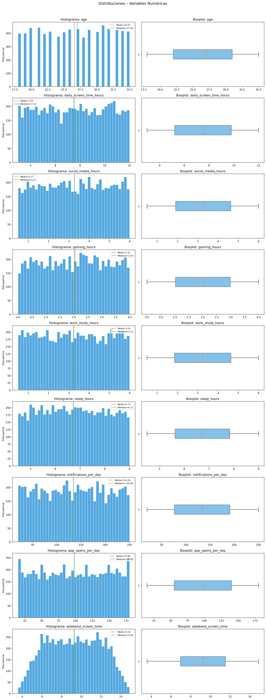

Todas las variables numéricas se aproximan a una **distribución uniforme**. El test de Shapiro-Wilk rechaza la normalidad (alfa = 0.05) en todas ellas, con p-valores del orden de 10^-30 a 10^-38. Esto implica que se deberán usar métodos **no paramétricos** o correlación robusta (Spearman) cuando corresponda.

**Variables categóricas y variable objetivo**

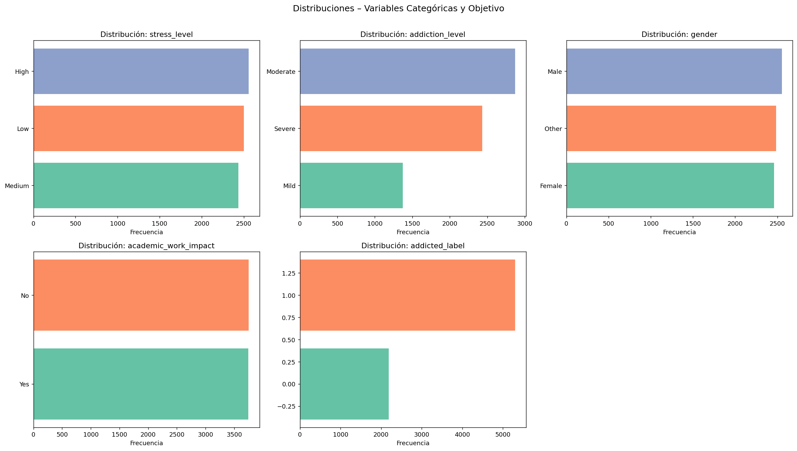

| Variable | Distribución |
|----------|-------------|
| `stress_level` | Equilibrada (~33% por categoría) |
| `gender` | Equilibrada (~33% por categoría) |
| `academic_work_impact` | Perfectamente balanceada (50/50) |
| `addiction_level` | Desbalanceada: Moderate 43%, Severe 36.4%, Mild 20.6% *(819 NaN)* |
| **`addicted_label`** | **Desbalanceada: 70.8% adictos / 29.2% no adictos** |

!!! important "Desbalance en la variable objetivo"
    Ratio 2.42:1. Se deberá considerar SMOTE, ponderación de clases o métricas robustas (F1-score, AUC-ROC).

---

**Análisis de correlaciones**

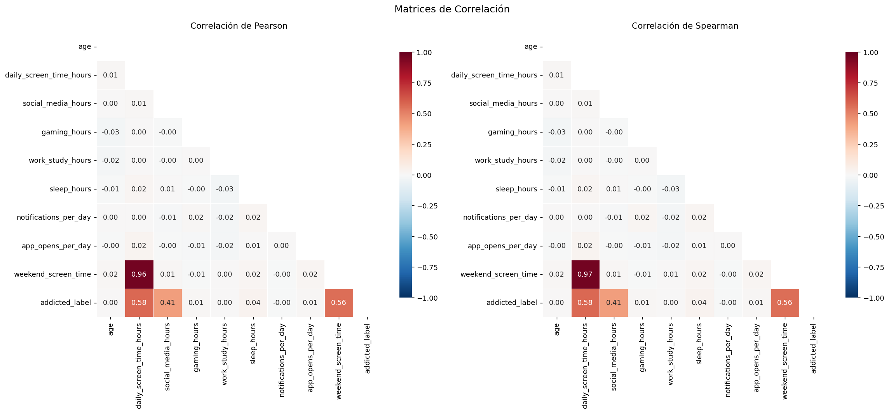

Las correlaciones de Pearson y Spearman son prácticamente idénticas.

**Correlaciones significativas (|r| > 0.3)**

| Par de variables | r (Pearson) | Interpretación |
|-----------------|-------------|----------------|
| `daily_screen_time_hours` - `weekend_screen_time` | **0.964** | Redundancia casi total |
| `daily_screen_time_hours` - `addicted_label` | **0.577** | Correlación fuerte con el target |
| `weekend_screen_time` - `addicted_label` | **0.555** | Correlación fuerte con el target |
| `social_media_hours` - `addicted_label` | **0.414** | Correlación moderada con el target |

**Correlaciones con la variable objetivo**

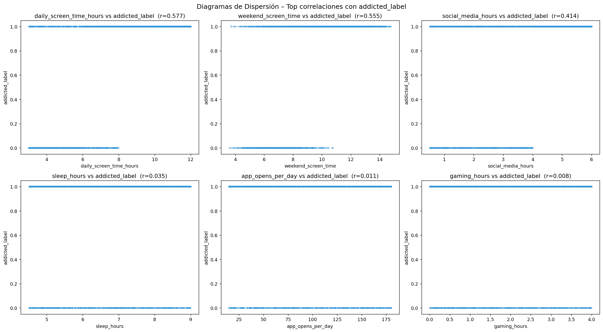

| Variable | r | Relevancia |
|----------|---|------------|
| `daily_screen_time_hours` | +0.577 | *** Alta |
| `weekend_screen_time` | +0.555 | *** Alta |
| `social_media_hours` | +0.414 | ** Moderada |
| `sleep_hours` | +0.036 | Baja |
| Resto de variables | < 0.01 | Insignificante |

!!! tip "Hallazgos clave"
    - Solo **3 variables** muestran correlación relevante con la adicción.
    - `daily_screen_time_hours` y `weekend_screen_time` son casi colineales (r = 0.964): una es redundante.
    - `gaming_hours`, `work_study_hours`, `notifications_per_day` y `app_opens_per_day` no tienen relación lineal con la adicción.

---

**Detección de outliers**

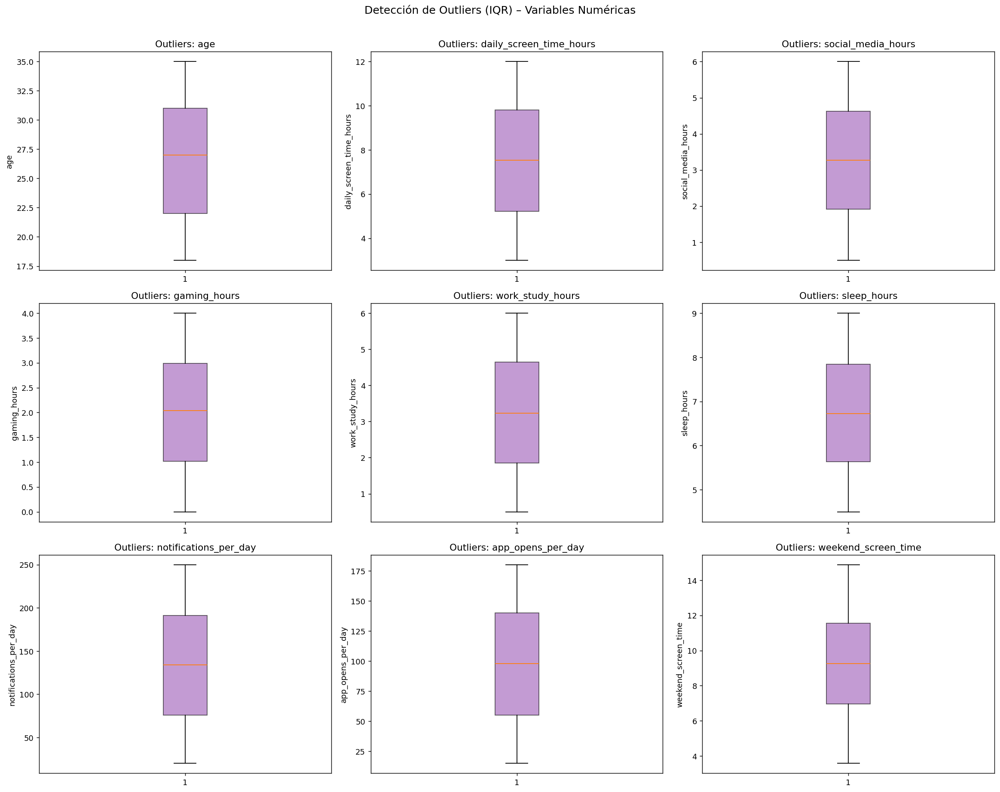

El método IQR no detecta **ningún outlier** en ninguna variable numérica. Esto, combinado con las distribuciones uniformes, confirma que el dataset ha sido generado sintéticamente con rangos acotados. No se requiere tratamiento de outliers.

---

**Relación entre variables categóricas y la variable objetivo**

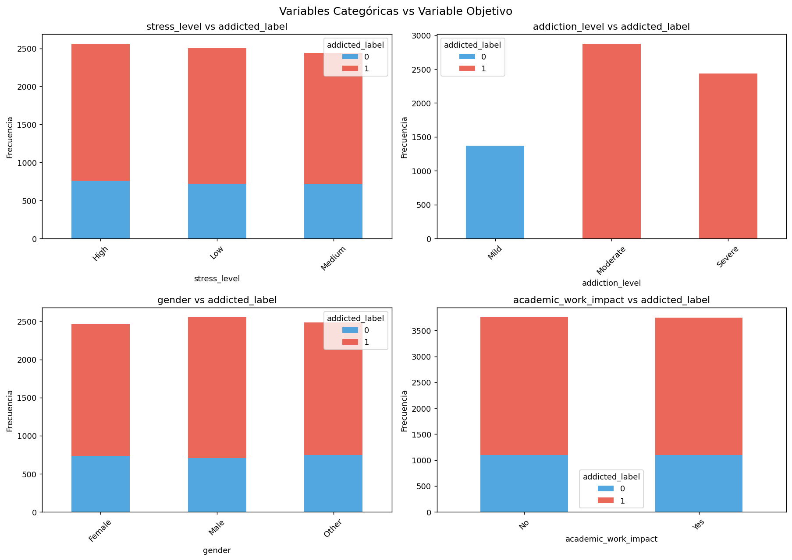

Las proporciones de adicción son **prácticamente iguales** en todas las categorías de `stress_level` (~70%), `gender` (~70%) y `academic_work_impact` (70.8% exacto en ambas). Estas variables **no aportan poder discriminante**.

La variable `addiction_level` presenta relación **100% determinista** con el target (Mild => 0, Moderate/Severe => 1), confirmando que debe excluirse del modelado.

---

**Distribuciones por grupo de adicción**

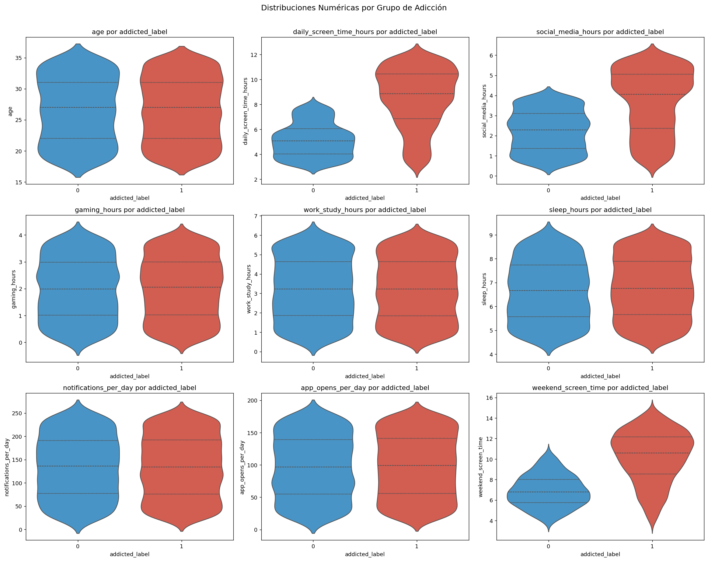

| Variable | Media (No adicto) | Media (Adicto) | Diferencia |
|----------|-------------------|----------------|------------|
| `daily_screen_time_hours` | 5.16 | 8.47 | **+3.31 h** |
| `weekend_screen_time` | 6.90 | 10.21 | **+3.32 h** |
| `social_media_hours` | 2.25 | 3.70 | **+1.45 h** |

El resto de variables (`age`, `gaming_hours`, `work_study_hours`, `sleep_hours`, `notifications_per_day`, `app_opens_per_day`) muestran distribuciones casi idénticas entre grupos (diferencias < 1.2 unidades).

---

**Pairplot de variables clave**

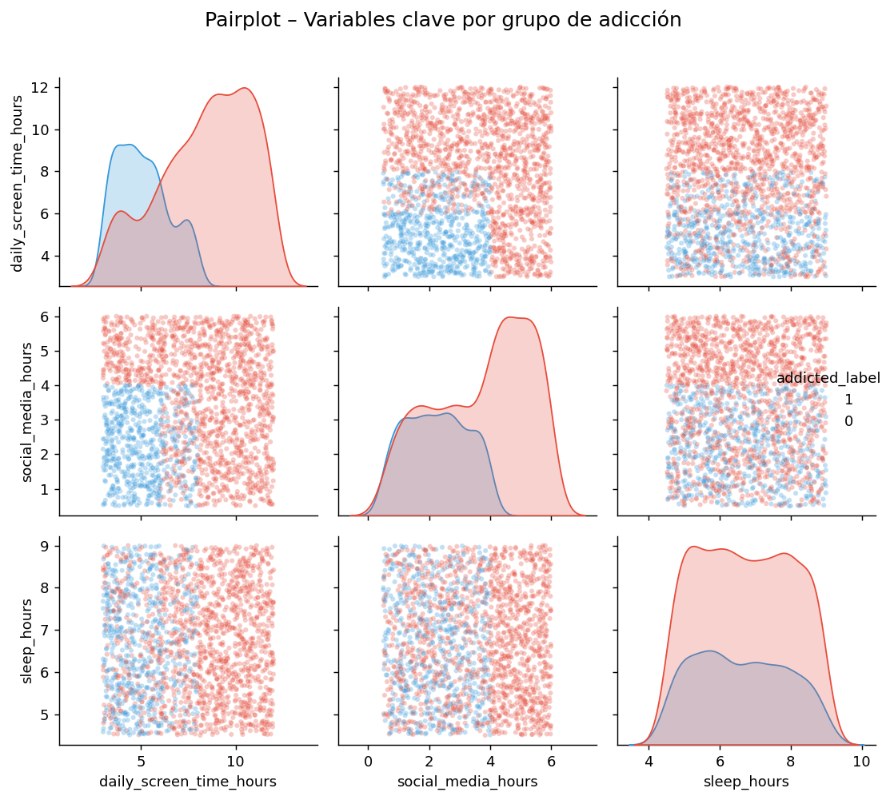

La separación entre clases se produce principalmente en los ejes de `daily_screen_time_hours` y `social_media_hours`, con solapamiento parcial entre grupos.

---

**Conclusiones del EDA y plan de preprocesamiento**

**Hallazgos principales**

1. **Dataset limpio:** Solo `addiction_level` tiene faltantes (10.9%). Sin outliers, duplicados ni inconsistencias.
2. **Distribuciones uniformes y sintéticas:** Curtosis ~= -1.2, distribuciones no normales.
3. **Tres variables discriminantes:** `daily_screen_time_hours` (r=0.577), `weekend_screen_time` (r=0.555), `social_media_hours` (r=0.414).
4. **Colinealidad extrema:** `daily_screen_time_hours` y `weekend_screen_time` (r=0.964).
5. **Categóricas no informativas:** `stress_level`, `gender` y `academic_work_impact` no discriminan.
6. **Desbalance moderado** en el target: 70.8% / 29.2%.

**Plan de preprocesamiento**

| Paso | Acción | Justificación |
|------|--------|---------------|
| 1 | Eliminar `transaction_id`, `user_id` | Identificadores sin valor predictivo |
| 2 | Eliminar `addiction_level` | Data leakage |
| 3 | Eliminar `weekend_screen_time` | Colinealidad extrema (r = 0.964) |
| 4 | Codificar `gender` y `academic_work_impact` | One-hot encoding |
| 5 | Codificar `stress_level` | Ordinal encoding (Low=0, Medium=1, High=2) |
| 6 | Selección de variables (Stepwise/PCA) | Reducir dimensionalidad |
| 7 | Gestionar desbalance de clases | SMOTE, ponderación o estratificación en CV |

---

## 1.3. Preprocesamiento y Exportación

**Tratamiento de valores faltantes**

**Localización y diagnóstico**

El **100% de las filas con NaN** en `addiction_level` pertenecen al grupo no adicto (`addicted_label = 0`). Para determinar el mecanismo de pérdida se realizaron:

- **Test Chi^2 de independencia:** Chi^2 = 2222.51, gl = 1, p ~= 0. Se rechaza H0: los NaN dependen del target. Mecanismo **MAR**.
- **Test t de Welch:** Diferencias significativas en `daily_screen_time_hours` (4.523 vs 7.865, p ~= 0) y `social_media_hours` (2.241 vs 3.400, p = 6.86 x 10^-137), explicadas porque los NaN pertenecen exclusivamente al grupo no adicto.

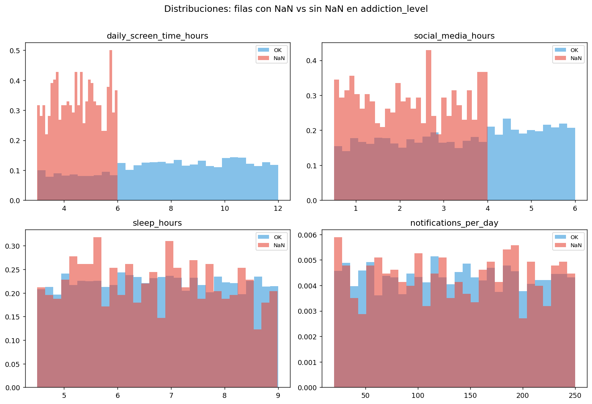

**Relación determinista y decisión**

La tabla cruzada confirma correspondencia **100% determinista** entre `addiction_level` y `addicted_label`:

| addiction_level | addicted_label = 0 | addicted_label = 1 |
|----------------|--------------------|--------------------|
| (NaN) | 819 | 0 |
| Mild | 1 373 | 0 |
| Moderate | 0 | 2 874 |
| Severe | 0 | 2 434 |

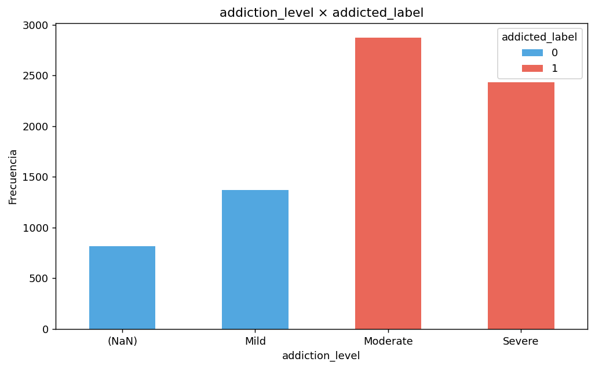

!!! warning "Decisión: eliminar `addiction_level`"
    1. **Imputación trivial:** Los 819 NaN son todos label=0, se imputarían como "Mild" sin aportar información.
    2. **Data leakage:** El modelo aprendería la regla determinista en lugar de patrones reales.
    3. **Confirmación estadística:** Chi^2 (p ~= 0) y tabla cruzada 1:1.
    4. **Sin pérdida de datos:** Se eliminan columnas, no filas. Se conservan las 7 500 observaciones.

---

**Ingeniería de características y selección de variables**

**Preparación previa**

**Variables eliminadas:** `transaction_id`, `user_id` (IDs), `addiction_level` (leakage), `weekend_screen_time` (colinealidad).

**Codificación de categóricas:**

| Variable | Codificación | Resultado |
|----------|-------------|-----------|
| `stress_level` | Ordinal | Low=0, Medium=1, High=2 |
| `academic_work_impact` | Binaria | No=0, Yes=1 |
| `gender` | One-hot (drop_first) | `gender_Male`, `gender_Other` |

Tras estas transformaciones: **12 variables** numéricas candidatas.

**Método: Stepwise Forward con AIC**

Se utiliza el criterio de información de Akaike (AIC = 2k - 2ln(L)) con regresión logística. En cada paso se añade la variable que más reduce el AIC, deteniéndose cuando ninguna mejora el criterio.

**Resultados del Stepwise Forward**

| Paso | Variable añadida | AIC |
|------|-----------------|-----|
| 0 | *(intercepto)* | 9 064.53 |
| 1 | `daily_screen_time_hours` | 6 127.82 |
| 2 | `social_media_hours` | 3 692.61 |
| 3 | `sleep_hours` | 3 687.77 |
| 4 | *ninguna mejora* => STOP | - |

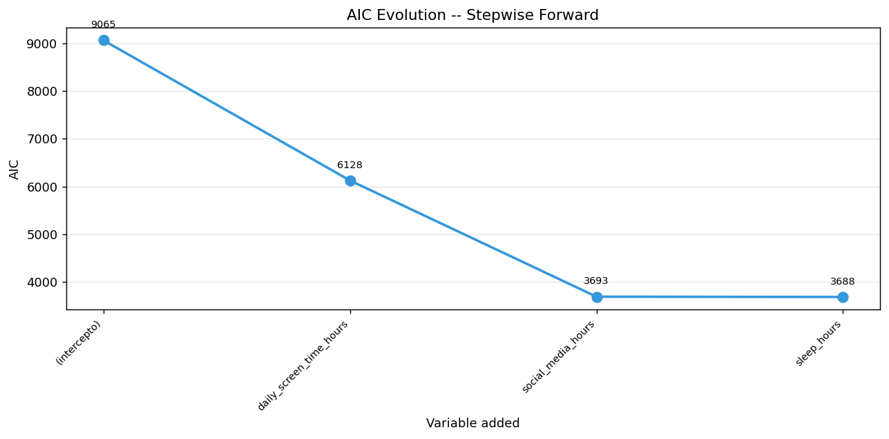

**Variables seleccionadas (3) y modelo final**

| Variable | Coeficiente (Logit) | p-valor | Interpretación |
|----------|--------------------:|--------:|----------------|
| `daily_screen_time_hours` | +1.193 | < 0.001 | Mayor pantalla -> mayor adicción |
| `social_media_hours` | +1.461 | < 0.001 | Mayor uso RRSS -> mayor adicción |
| `sleep_hours` | +0.086 | 0.009 | Relación positiva débil pero significativa |

Las 9 variables restantes (`age`, `gaming_hours`, `work_study_hours`, `notifications_per_day`, `app_opens_per_day`, `stress_level`, `academic_work_impact`, `gender_Male`, `gender_Other`) fueron descartadas por no mejorar el AIC.

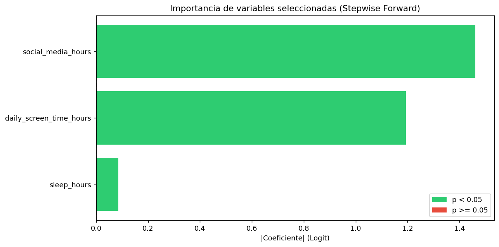

**Métricas del modelo logístico final:** Pseudo R^2 (McFadden) = 0.594, AIC = 3 687.77, todas las variables significativas al nivel alfa = 0.01.

**Correlaciones del dataset final**

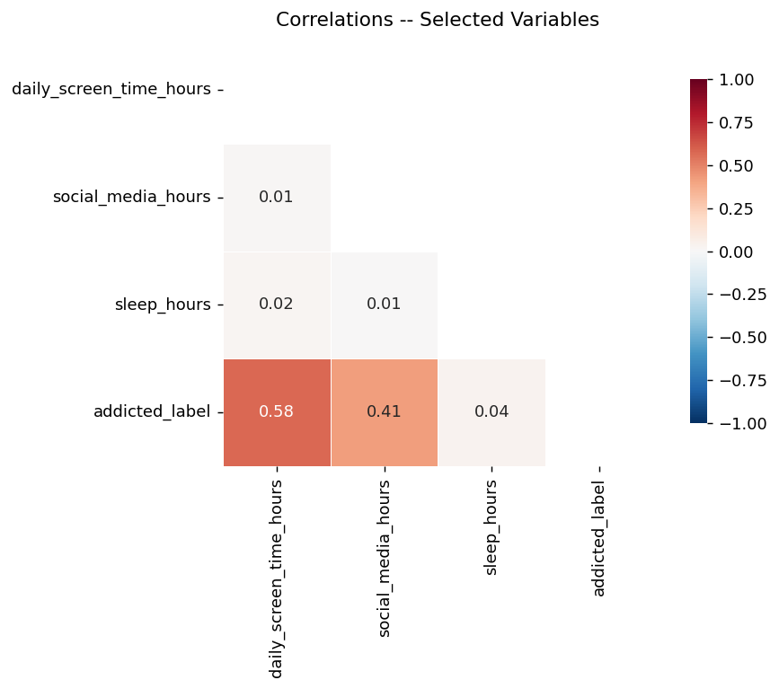

Las tres variables seleccionadas presentan baja correlación entre sí, confirmando que aportan información complementaria.

---

**Dataset final exportado**

El dataset limpio se ha guardado en `data/data_clean.csv`:

| # | Columna | Rol | Tipo |
|---|---------|-----|------|
| 1 | `daily_screen_time_hours` | Predictora | float64 |
| 2 | `social_media_hours` | Predictora | float64 |
| 3 | `sleep_hours` | Predictora | float64 |
| 4 | `addicted_label` | Target | int64 |

- **Filas:** 7 500 (sin pérdidas) | **Columnas:** 4 | **Valores faltantes:** 0

---

**Validación mediante tests automatizados**

Se han desarrollado tres suites de tests con pytest para garantizar la reproducibilidad:

**`tests/test_eda.py`** - 23 tests en 6 clases que validan: carga y estructura del CSV, tipos de datos, valores faltantes (solo `addiction_level`), rangos numéricos y ausencia de outliers, categorías esperadas, y generación de los 9 gráficos.

**`tests/test_tratamiento.py`** - 5 tests que validan: NaN solo en `addiction_level`, todos los NaN son label=0, relación determinista Mild->0 y Moderate/Severe->1, y generación de gráficos.

**`tests/test_ingenieria.py`** - 5 tests que validan: existencia de `data_clean.csv`, columnas esperadas, ausencia de NaN, conservación de 7 500 filas, y generación de gráficos.

```bash
uv run pytest tests/ -v
```


---

## 2. Modelización Supervisada y Contraste

## 2.1. Estrategia de modelización

**Objetivo**

Contrastar modelos de **tres naturalezas distintas** para predecir la adicción al smartphone (`addicted_label`), según los requisitos del enunciado:

| Categoría | Modelo | Justificación |
|-----------|--------|---------------|
| **Baseline (lineal)** | Regresión Logística | Modelo interpretable que establece la referencia |
| **Modelo flexible** | SVM con kernel RBF | Captura relaciones no lineales en el espacio de características |
| **Ensemble (agregación)** | Random Forest | Método de bagging que reduce varianza y mejora robustez |

**Pipeline**

- **División Train/Test:** 80/20 estratificado (semilla 42)
- **Validación cruzada:** StratifiedKFold con 5 folds para ajuste de hiperparámetros
- **Métrica de optimización:** AUC-ROC (robusta ante desbalance)
- **Estandarización:** StandardScaler ajustado solo en train (evita data leakage)
- **Métricas de evaluación:** Accuracy, Precision, Recall, F1-Score, AUC-ROC

**División de datos**

| Conjunto | Observaciones | % Positivos |
|----------|---------------|-------------|
| **Train** | 6 000 | 70.8% |
| **Test** | 1 500 | 70.8% |

La estratificación garantiza que ambos conjuntos mantienen la misma proporción del target.

---

## 2.2. Modelo 1: Regresión Logística (Baseline)

**Justificación**

La regresión logística es el baseline natural para clasificación binaria. Como modelo lineal generalizado (GLM), proporciona coeficientes interpretables y una referencia contra la que medir modelos más complejos.

**Ajuste de hiperparámetros**

| Hiperparámetro | Valores explorados | Mejor valor |
|---------------|--------------------|-------------|
| `C` (regularización) | 0.001, 0.01, 0.1, 1, 10, 100 | **0.1** |
| `penalty` | L1, L2 | **L2** |
| `solver` | saga | saga |
| `class_weight` | None, balanced | **None** |

El valor óptimo de `C = 0.1` indica que se beneficia de una regularización moderada, penalizando coeficientes excesivamente grandes.

**Coeficientes del modelo**

| Variable | Coeficiente (estandarizado) | Interpretación |
|----------|----------------------------:|----------------|
| `daily_screen_time_hours` | +2.794 | Mayor tiempo de pantalla => mayor riesgo |
| `social_media_hours` | +2.064 | Mayor uso de RRSS => mayor riesgo |
| `sleep_hours` | +0.108 | Efecto positivo débil pero significativo |
| *(intercepto)* | +2.278 | Sesgo base hacia la clase positiva |

**Resultados**

| Métrica | Valor |
|---------|-------|
| **Accuracy** | 0.8927 |
| **Precision** | 0.9122 |
| **Recall** | 0.9388 |
| **F1-Score** | 0.9253 |
| **AUC-ROC** | 0.9544 |

> [!NOTE]
> El modelo logístico ya consigue un AUC-ROC de 0.954, lo que indica que las relaciones lineales capturan una gran parte de la estructura del problema.

---

## 2.3. Modelo 2: SVM con kernel RBF (Modelo Flexible)

**Justificación**

El SVM con kernel gaussiano (RBF) proyecta los datos a un espacio de alta dimensionalidad donde las clases pueden ser separadas por un hiperplano. Permite capturar **relaciones no lineales** sin asumir una forma funcional concreta.

**Ajuste de hiperparámetros**

| Hiperparámetro | Valores explorados | Mejor valor |
|---------------|--------------------|-------------|
| `C` (coste) | 0.1, 1, 10, 100 | **100** |
| `gamma` (ancho del kernel) | scale, auto, 0.01, 0.1, 1 | **1** |
| `class_weight` | None, balanced | **None** |

Un valor alto de `C = 100` y `gamma = 1` indica que el modelo explota fronteras de decisión complejas y localizadas, adaptándose finamente a la estructura de los datos.

**Resultados**

| Métrica | Valor |
|---------|-------|
| **Accuracy** | 0.9307 |
| **Precision** | 0.9553 |
| **Recall** | 0.9463 |
| **F1-Score** | 0.9508 |
| **AUC-ROC** | 0.9850 |

**Vectores soporte:** 834 (422 clase 0 + 412 clase 1), representando un 13.9% de los datos de entrenamiento.

> [!TIP]
> La mejora de +3.06 puntos en AUC-ROC respecto al baseline confirma la presencia de relaciones no lineales que la regresión logística no captura.

---

## 2.4. Modelo 3: Random Forest (Ensemble)

**Justificación**

Random Forest es un método de agregación (*bagging*) que combina múltiples árboles de decisión entrenados sobre submuestras aleatorias. Reduce la varianza sin aumentar significativamente el sesgo, y proporciona una medida natural de importancia de variables.

**Ajuste de hiperparámetros**

| Hiperparámetro | Valores explorados | Mejor valor |
|---------------|--------------------|-------------|
| `n_estimators` | 100, 200, 500 | **100** |
| `max_depth` | 3, 5, 10, None | **None** |
| `min_samples_split` | 2, 5, 10 | **2** |
| `class_weight` | None, balanced | **None** |

La profundidad ilimitada (`max_depth=None`) y `min_samples_split=2` indican que los árboles se desarrollan completamente. El modelo con solo 100 árboles ya converge.

**Importancia de variables (Gini)**

| Variable | Importancia | Interpretación |
|----------|------------:|----------------|
| `daily_screen_time_hours` | **0.556** | Variable dominante |
| `social_media_hours` | **0.382** | Segunda en importancia |
| `sleep_hours` | 0.062 | Contribución marginal |

**Resultados**

| Métrica | Valor |
|---------|-------|
| **Accuracy** | 0.9327 |
| **Precision** | 0.9563 |
| **Recall** | 0.9482 |
| **F1-Score** | 0.9522 |
| **AUC-ROC** | 0.9891 |

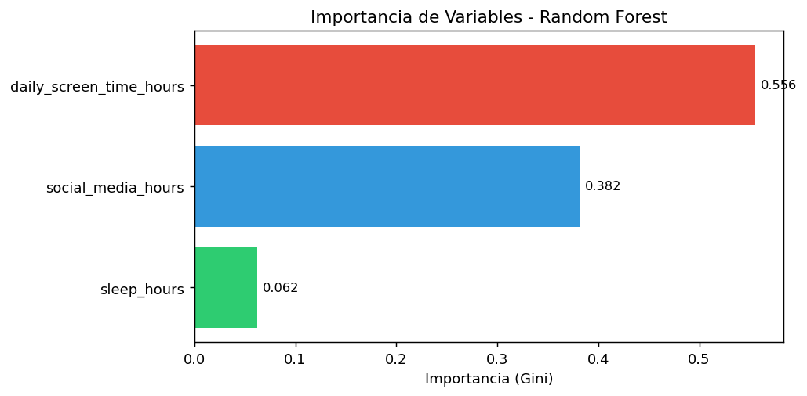

---

## 2.5. Comparativa de modelos

**Tabla resumen de métricas en Test**

| Modelo | Accuracy | Precision | Recall | F1-Score | AUC-ROC |
|--------|:--------:|:---------:|:------:|:--------:|:-------:|
| Regresión Logística | 0.8927 | 0.9122 | 0.9388 | 0.9253 | 0.9544 |
| SVM (RBF) | 0.9307 | 0.9553 | 0.9463 | 0.9508 | 0.9850 |
| **Random Forest** | **0.9327** | **0.9563** | **0.9482** | **0.9522** | **0.9891** |

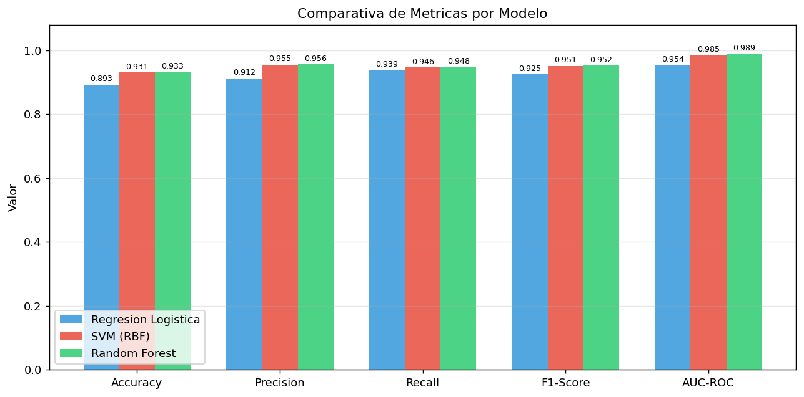

**Curvas ROC**

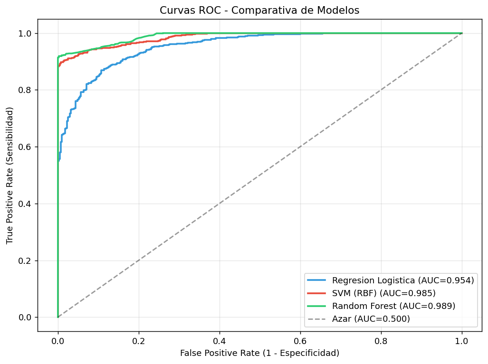

Las tres curvas muestran un excelente poder discriminante. Random Forest y SVM presentan curvas prácticamente superpuestas, ambas claramente superiores al baseline logístico.

**Matrices de confusión**

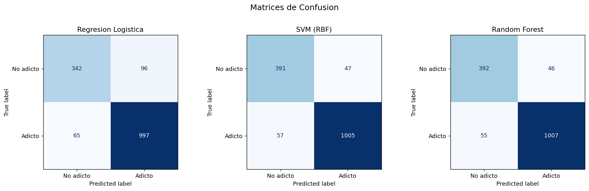

**Distribución de probabilidades predichas**

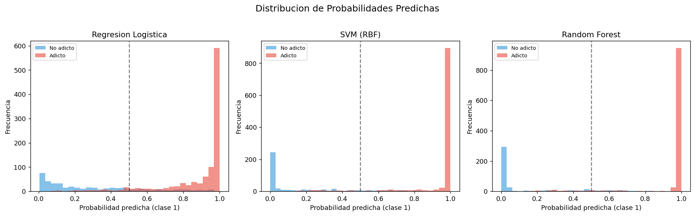

Los modelos flexibles (SVM y RF) producen distribuciones más separadas entre clases, lo que indica mayor confianza en las predicciones.

---

## 2.6. Análisis del compromiso sesgo-varianza

**Métricas de Train vs Validación (AUC-ROC)**

| Modelo | CV Train | CV Validación | Gap | Diagnóstico |
|--------|:--------:|:-------------:|:---:|-------------|
| Regresión Logística | 0.9529 | 0.9529 | **0.0000** | Buen ajuste |
| SVM (RBF) | 0.9916 | 0.9868 | **0.0048** | Buen ajuste |
| Random Forest | 1.0000 | 0.9900 | **0.0100** | Buen ajuste |

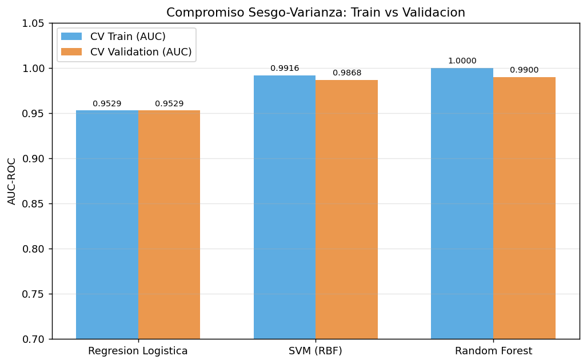

**Learning curves**

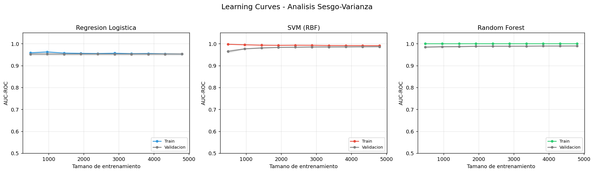

**Interpretación:**

- **Regresión Logística:** Las curvas de train y validación convergen rápidamente y se mantienen juntas. Gap nulo (0.000) confirma que el modelo está limitado por su **sesgo** (no puede capturar relaciones no lineales), no por varianza.
- **SVM (RBF):** Gap mínimo (0.005). El modelo tiene suficiente flexibilidad para capturar la no linealidad sin sobreajustar. Buen equilibrio.
- **Random Forest:** Gap de 0.010 con AUC train = 1.000, lo que indica que los árboles individuales memorizan el train, pero la agregación por bagging controla eficazmente la varianza. El rendimiento en validación (0.990) es el más alto.

> [!IMPORTANT]
> Ningún modelo presenta sobreajuste problemático. El gap máximo (Random Forest, 0.010) es muy pequeño, confirmando que la validación cruzada con 5 folds y el tamaño de la muestra (6 000 train) son adecuados para los tres modelos.

---

## 2.7. Conclusiones de la modelización

**Ranking de modelos**

1. **Random Forest** (AUC = 0.989) - Mejor rendimiento global con gap sesgo-varianza controlado.
2. **SVM (RBF)** (AUC = 0.985) - Rendimiento muy similar al RF con mejor equilibrio sesgo-varianza.
3. **Regresión Logística** (AUC = 0.954) - Baseline sólido pero limitado por su linealidad.

Aspectos a destacar:

- La **mejora del baseline a los modelos flexibles** (+3.5 puntos AUC) confirma la existencia de relaciones no lineales en los datos, aunque la mayor parte de la estructura es capturada linealmente.
- Las dos variables más importantes (`daily_screen_time_hours` y `social_media_hours`) dominan las predicciones en todos los modelos, con `sleep_hours` aportando información complementaria marginal.
- El desbalance de clases (70.8% / 29.2%) no requirió tratamiento especial (`class_weight=None` fue óptimo en los tres modelos), gracias a que el desbalance es moderado y los modelos discriminan bien.
- Los tres modelos alcanzan alta precision y recall simultáneamente, con F1 > 0.92 en todos los casos.

---

## 3. Aprendizaje No Supervisado

## 3.1. Clustering Jerárquico Aglomerativo

**Objetivo**

Identificar **estructuras naturales** en los datos sin utilizar las etiquetas de adicción, analizar los perfiles de los clusters obtenidos e interpretar qué patrones de comportamiento subyacen en los datos.

**Metodología**

- **Algoritmo:** Clustering Jerárquico Aglomerativo
- **Método de enlace:** Ward (minimiza la varianza intra-cluster)
- **Métrica de distancia:** Euclídea
- **Estandarización:** StandardScaler (necesario para que todas las variables contribuyan equitativamente)
- **Selección de k:** Silhouette Score para k = 2, ..., 6

**Dendrogramas**

Se comparan tres métodos de enlace (Ward, Complete, Average) sobre una submuestra de 1 500 observaciones:

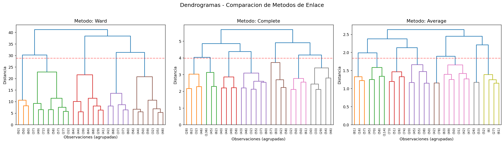

El método **Ward** produce las fusiones más equilibradas y compactas. Los tres dendrogramas muestran una estructura jerárquica gradual, sin cortes naturales muy marcados.

---

## 3.2. Selección del número de clusters

**Silhouette Score por k**

| k | Silhouette Score |
|:-:|:----------------:|
| 2 | 0.1967 |
| 3 | 0.2066 |
| 4 | 0.1945 |
| 5 | 0.1996 |
| **6** | **0.2071** |

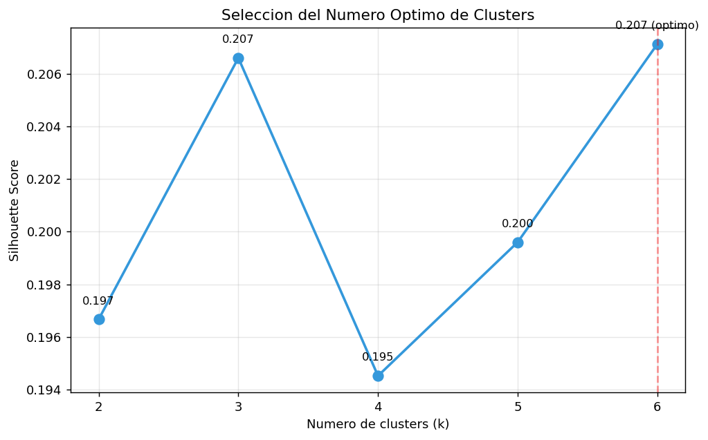

**Decisión**

Los valores de Silhouette son bajos (todos < 0.21), lo que indica que los datos no forman clusters bien separados, consistente con las distribuciones uniformes detectadas en el EDA. Se selecciona **k = 6** por ser el valor que maximiza el Silhouette Score (0.2071).

---

## 3.3. Perfilado de clusters

**Distribución**

| Cluster | Observaciones | Porcentaje |
|:-------:|:-------------:|:----------:|
| 0 | 778 | 10.4% |
| 1 | 1 042 | 13.9% |
| 2 | 1 880 | 25.1% |
| 3 | 1 934 | 25.8% |
| 4 | 773 | 10.3% |
| 5 | 1 093 | 14.6% |

Los clusters 2 y 3 son los más grandes (~25% cada uno), mientras que los clusters 0 y 4 son los más pequeños (~10%).

**Medias por cluster**

| Cluster | `daily_screen_time_hours` | `social_media_hours` | `sleep_hours` |
|:-------:|:-------------------------:|:--------------------:|:-------------:|
| 0 | 8.71 | **5.11** | 5.56 |
| 1 | **4.59** | 2.80 | **5.48** |
| 2 | 8.56 | **2.16** | 5.97 |
| 3 | **10.00** | 3.68 | 7.70 |
| 4 | **4.82** | **5.06** | 7.33 |
| 5 | 5.06 | 2.35 | **7.97** |
| *Global* | *7.50* | *3.27* | *6.74* |

En negrita los valores notablemente por encima/debajo de la media global.

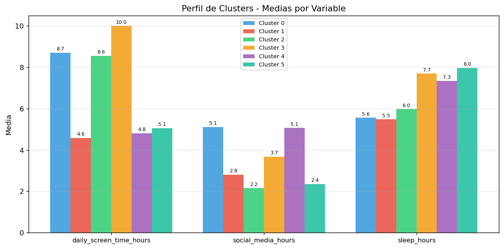

**Interpretación de los perfiles**

| Cluster | Perfil | Descripción |
|:-------:|--------|-------------|
| **0** | **Uso intensivo en RRSS, poco sueño** | Alto screen time (8.7 h), máximo uso de RRSS (5.1 h), poco sueño (5.6 h) |
| **1** | **Bajo uso general, poco sueño** | Mínimo screen time (4.6 h), uso moderado de RRSS, mínimo sueño (5.5 h) |
| **2** | **Pantalla alta sin RRSS, poco sueño** | Screen time alto (8.6 h) pero mínimo en RRSS (2.2 h), sueño bajo (6.0 h) |
| **3** | **Uso máximo de pantalla, buen sueño** | Máximo screen time (10.0 h), RRSS moderadas, buen sueño (7.7 h) |
| **4** | **Bajo screen time, alto RRSS, buen sueño** | Screen time bajo (4.8 h), RRSS alto (5.1 h), buen sueño (7.3 h) |
| **5** | **Bajo uso general, máximo sueño** | Screen time bajo (5.1 h), RRSS bajo (2.4 h), máximo sueño (8.0 h) |

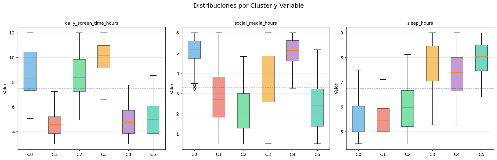

---

## 3.4. Análisis detallado y visualización

**Silhouette por cluster**

| Cluster | Silhouette medio | Calidad |
|:-------:|:----------------:|---------|
| 0 | 0.3231 | Moderada |
| 1 | 0.2729 | Moderada |
| 2 | 0.1247 | Baja |
| 3 | 0.1126 | Baja |
| 4 | 0.3494 | Moderada |
| 5 | 0.2703 | Moderada |
| **Global** | **0.2071** | **Baja** |

Los clusters 0 y 4 (los más pequeños y diferenciados por alto uso de RRSS) tienen la mejor cohesión. Los clusters 2 y 3 (los más grandes) tienen peor separación, lo que indica mayor solapamiento.

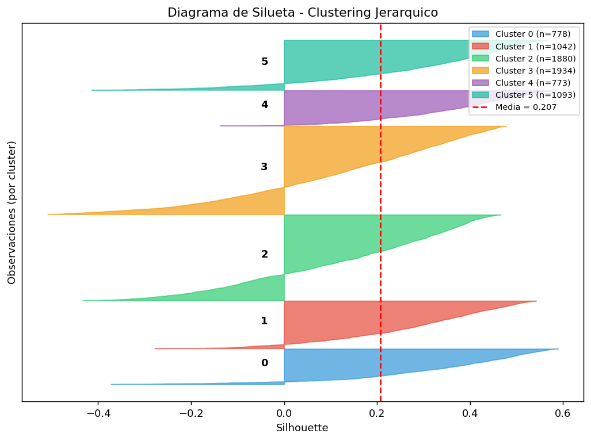

**Visualización 2D**

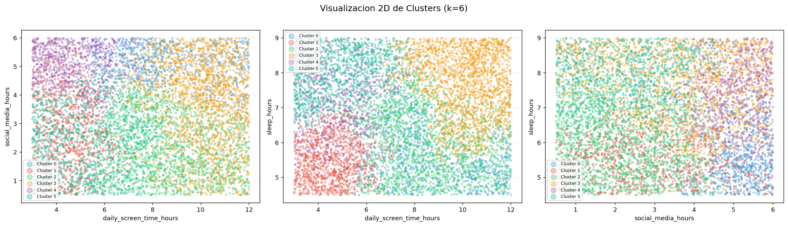

La visualización muestra que los clusters se organizan como una partición del espacio tridimensional en regiones, con solapamiento parcial en las proyecciones 2D. La separación más clara se observa en el plano `daily_screen_time_hours` vs `sleep_hours`.

---

## 3.5. Conclusiones del aprendizaje no supervisado

1. **Se identifican 6 perfiles de uso del smartphone** con el clustering jerárquico (Ward, k = 6). Aunque los Silhouette son bajos (0.21), los clusters revelan patrones interpretables.

2. **Los clusters se diferencian por combinaciones de las tres variables**, no por una sola. El eje principal de separación es `daily_screen_time_hours` (4.6 - 10.0 h), seguido de `social_media_hours` (2.2 - 5.1 h) y `sleep_hours` (5.5 - 8.0 h).

3. **Perfiles extremos:** El Cluster 3 (máximo uso, buen sueño) y el Cluster 5 (mínimo uso, máximo sueño) representan los dos extremos del espectro. El Cluster 0 (alto uso + alto RRSS + poco sueño) es el perfil de mayor riesgo potencial.

4. **Limitación:** Los valores bajos de Silhouette reflejan la naturaleza uniforme y sintética del dataset, donde las fronteras entre grupos son graduales en lugar de abruptas. En datos reales, se esperaría una estructura de clusters más marcada.

---

## 4. Interpretación y Conclusiones

## 4.1. Diagnóstico del modelo lineal: Análisis de residuos

**Modelo analizado**

Se utiliza la Regresión Logística (ajustada con statsmodels para obtener diagnósticos completos) sobre el conjunto de test (1 500 observaciones). El modelo tiene un Pseudo R^2 (McFadden) = 0.594, lo que indica un buen ajuste.

**Residuos de devianza**

| Estadístico | Valor |
|-------------|:-----:|
| Media | 0.0148 |
| Desviación típica | 0.6993 |
| Mínimo | -2.7657 |
| Máximo | 2.4575 |

La media cercana a cero indica ausencia de sesgo sistemático. La desviación típica inferior a 1 es coherente con un modelo que ajusta bien (en un modelo perfecto los residuos de devianza tendrían desviación unitaria).

**Residuos de Pearson**

| Estadístico | Valor |
|-------------|:-----:|
| Media | -0.0246 |
| Desviación típica | 0.7812 |
| Mínimo | -6.6942 |
| Máximo | 4.4142 |

Los residuos de Pearson muestran colas más largas que los de devianza, con valores extremos de hasta 6.7 en valor absoluto. Esto es esperable en regresión logística cuando las probabilidades predichas están cerca de 0 o 1.

**Gráficos de diagnóstico**

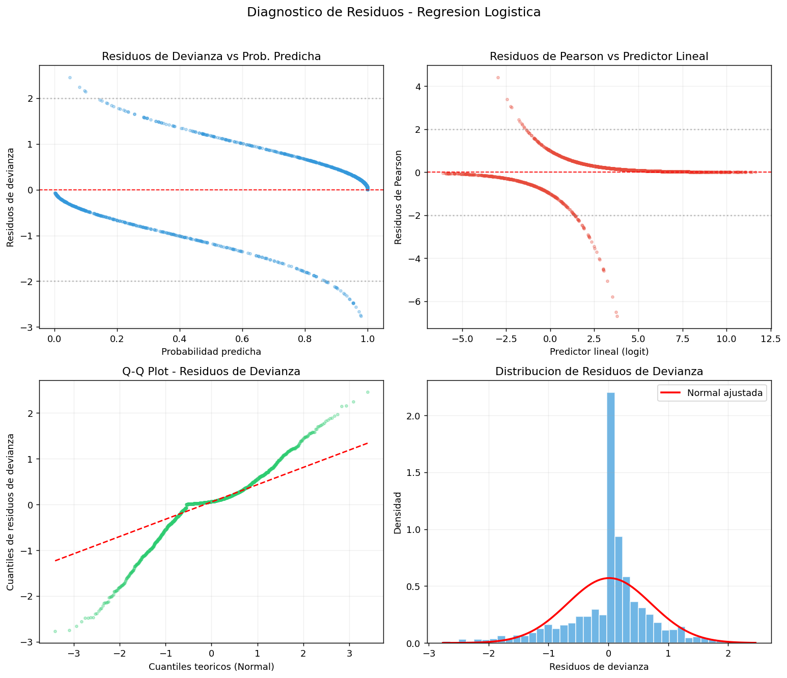

**Interpretación de cada panel:**

- **Residuos de devianza vs prob. predicha:** Se observan dos bandas (una para y=0 y otra para y=1), patrón típico y esperado en regresión logística con respuesta binaria. No se detectan patrones anómalos.
- **Residuos de Pearson vs predictor lineal:** La dispersión es mayor en la zona central del predictor lineal, donde la incertidumbre es máxima.
- **Q-Q Plot:** Los residuos se desvían de la normal en las colas, lo cual es normal en modelos logísticos (la distribución teórica no es normal sino chi-cuadrado).
- **Histograma:** La distribución de residuos es bimodal (dos picos correspondientes a las dos clases), comportamiento esperado en clasificación binaria.

**Test de Hosmer-Lemeshow**

| Parámetro | Valor |
|-----------|:-----:|
| Estadístico Chi^2 | 5.359 |
| Grados de libertad | 8 |
| p-valor | **0.7186** |
| Decisión | No se rechaza H0 |

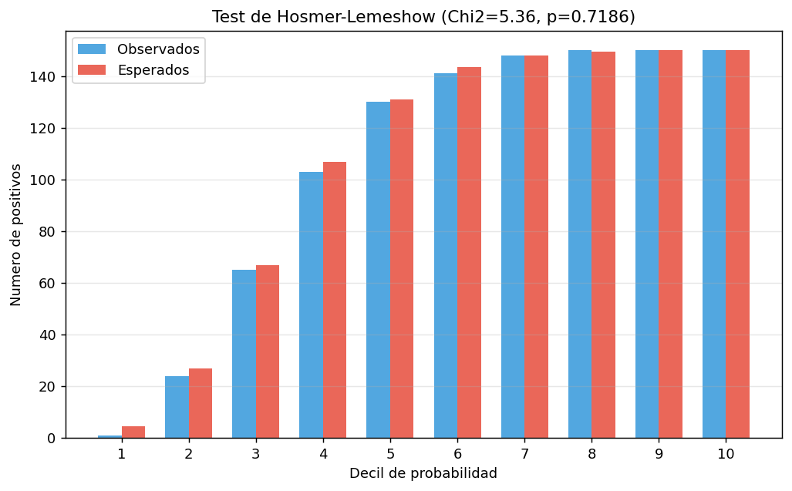

El p-valor de 0.72 (muy superior a 0.05) indica que **no hay evidencia de falta de ajuste**: las frecuencias observadas y esperadas son consistentes en todos los deciles de probabilidad. El modelo logístico ajusta adecuadamente los datos.

---

## 4.2. Importancia de variables en modelos de caja negra

**Importancia Gini (Random Forest)**

| Variable | Importancia Gini | Interpretación |
|----------|:----------------:|----------------|
| `daily_screen_time_hours` | **0.556** | Variable dominante (56% de la importancia) |
| `social_media_hours` | **0.382** | Segunda variable (38%) |
| `sleep_hours` | 0.062 | Contribución marginal (6%) |

La importancia Gini mide cuánto contribuye cada variable a la reducción de la impureza en las divisiones de los árboles.

**Permutation Importance (model-agnostic)**

Se calcula la caída en AUC-ROC al permutar cada variable (30 repeticiones), lo que mide la dependencia real del modelo en cada variable:

| Variable | Reg. Logística | SVM (RBF) | Random Forest |
|----------|:--------------:|:---------:|:-------------:|
| `daily_screen_time_hours` | 0.306 (+/-0.015) | **0.368 (+/-0.016)** | 0.342 (+/-0.014) |
| `social_media_hours` | 0.154 (+/-0.008) | **0.302 (+/-0.015)** | 0.247 (+/-0.012) |
| `sleep_hours` | 0.000 (+/-0.000) | -0.001 (+/-0.001) | 0.000 (+/-0.001) |

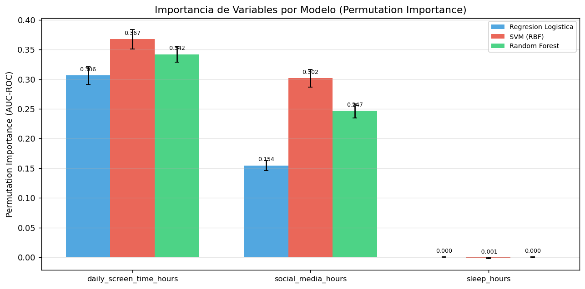

> [!NOTE]
> `sleep_hours` tiene importancia de permutación esencialmente **nula** en los tres modelos. Su selección por el stepwise forward (AIC) se debió a una mejora estadísticamente significativa pero prácticamente irrelevante.

**Comparativa Gini vs Permutation (Random Forest)**

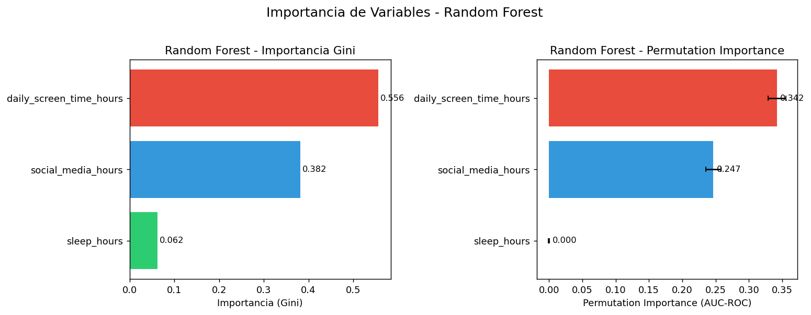

Ambos métodos coinciden en el ranking de las variables: `daily_screen_time_hours` más importante que `social_media_hours` y ambas mucho más importantes que `sleep_hours`. La importancia Gini sobreestima ligeramente la contribución de `sleep_hours` (0.062 vs 0.000 en permutación) porque mide uso en las divisiones, no impacto real en la predicción.

Los tres modelos coinciden en que `daily_screen_time_hours` es la variable **más importante** en todos los modelos, `social_media_hours` es la **segunda** en importancia con mayor peso relativo en SVM
y `sleep_hours` no aporta capacidad predictiva real

---

## 4.3. Interpretación del modelo logístico: Odds Ratios

| Variable | Odds Ratio | IC 95% | Interpretación |
|----------|:----------:|:------:|----------------|
| `daily_screen_time_hours` | **21.97** | [18.37, 26.29] | Por cada desv. típica de aumento, la odds de adicción se multiplica por 22 |
| `social_media_hours` | **9.83** | [8.50, 11.37] | Por cada desv. típica de aumento, la odds se multiplica por 10 |
| `sleep_hours` | 1.12 | [1.02, 1.23] | Efecto marginal: la odds aumenta un 12% |

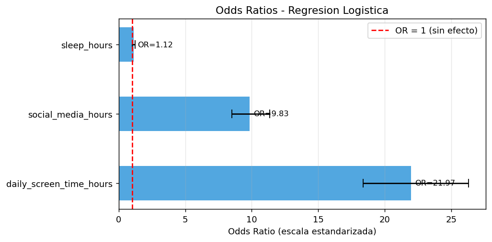

> [!IMPORTANT]
> Los odds ratios están calculados sobre variables **estandarizadas**, por lo que representan el efecto de un cambio de una desviación típica. El efecto de `daily_screen_time_hours` (OR = 22) es el más fuerte con diferencia.

---

## 4.4. Análisis crítico: limitaciones y sobreajuste

**Sobreajuste**

| Modelo | Gap Train-Valid | Diagnóstico |
|--------|:--------------:|-------------|
| Regresión Logística | 0.000 | Sin sobreajuste (modelo demasiado simple para sobreajustar) |
| SVM (RBF) | 0.005 | Sin sobreajuste relevante |
| Random Forest | 0.010 | Gap mínimo, controlado por el bagging |

Ningún modelo presenta sobreajuste problemático, confirmado por las learning curves de la Parte II.

**Limitaciones identificadas**

1. **Dataset sintético:** Las distribuciones uniformes y la ausencia total de outliers sugieren datos generados artificialmente, lo que limita la generalización a contextos reales.

2. **Pocas variables predictivas:** Solo 3 de las 12 variables originales resultaron informativas tras el stepwise, y de esas, `sleep_hours` es prácticamente irrelevante. El modelo depende esencialmente de 2 variables.

3. **Relación determinista parcial:** Los altos valores de AUC (0.95-0.99) sugieren que la variable objetivo fue generada como función de las predictoras, lo que explicaría la ausencia de ruido y la fácil separabilidad.

4. **Frontera de decisión:** La diferencia entre modelos lineales (AUC=0.954) y no lineales (AUC=0.989) indica que existe una componente no lineal en la frontera, pero la mayor parte de la estructura es capturada linealmente.

5. **Desbalance de clases:** Aunque el ratio 2.42:1 no requirió tratamiento especial aquí, en datos reales podría ser más extremo y necesitar técnicas de resampling.

6. **Modelo final:** En caso de elegir un modelo, optaría por el Random Forest por su mayor rendimiento predictivo pero como hemos visto debido a la base de datos no tenemos resultados válidos. Si analizamos la gráfica de la importancia de variables podemos ver que el modelo no es capaz de aprender la relación entre variables y la clase objetivo.

